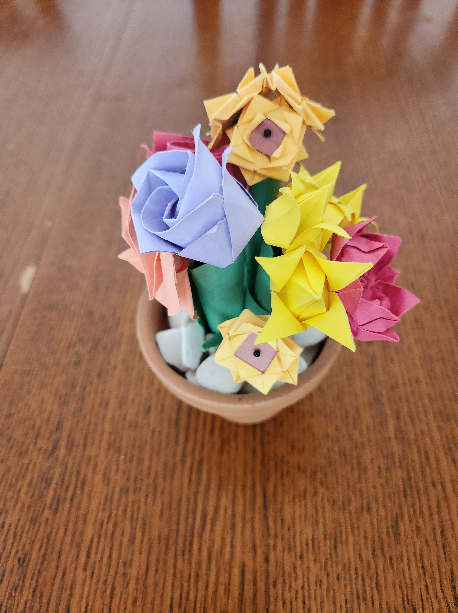

The choices to make origami sunflowers are few. I adapted the simple [Lotus Blossom](http://www.origami-instructions.com/origami-lotus-blossom.html) design from Origami-Instructions.com with an additional small square of brown paper, allowing for a very simple sunflower design that holds up against other designs that have more complicated multi-sheet folding, are hexagon-based, or require glue.

### Instructions

With the Blintz base, place a sheet of brown paper within the corner folds into the center.

It does not need to be large, but should be centered. The yellow paper will form an envelope around the sheet of brown paper. Fold the linked Lotus Blossom design above. On unfolding all of the center folds, the brown paper will be revealed, creating a sunflower-esque design.

Feel free to add a [simple stem](http://www.origami-instructions.com/easy-origami-tulip.html) as described at the end of this tutorial, or glue them flat against a scrapbook.

<figure>

<figcaption>

Sunflower against the sky.

</figcaption>

</figure>

For the flower pot, I used a pin in the center, fitted through a tightly folded up piece of green paper. While the rest does not use any other holding mechanic apart from folds, I though using a pin here was appropriate due to the back of the flower having very little holds (the worst outcome is for the present to immediately fall apart), and it being a sunflower! The pin adds a bit to the image of a sunflower, mimicking the sunflower's center. No point in restricting yourself to the limitations of a craft if they prevent you from getting the look that you want.

See a few other origami sunflowers in these articles for comparison:

- [Basic Sunflower from Origami instructions](http://www.origami-instructions.com/easy-origami-sunflower.html) (Dislike the design)

- [Sunflower by Karen Elaine](https://m.youtube.com/watch?v=G6H0Gf4kHYY) (very similar to the adapted lotus blossom design above, but slightly more difficult. Does come out with a more circular center, which I like)

- [Multi-piece sunflower on Origami Spirit](https://www.origamispirit.com/2015/07/origami-sunflower-1/) (many pieces, but pops. However, depending on the angle, the petals look slightly droopy. Not sure if it is the design or the camera)

- [Origami Sunflower designed by Jo Nakashima](https://jonakashima.com.br/2017/03/09/origami-sunflower/) (beautiful, but slightly more complex and may be difficult for beginners)

- I don't include any of the interlocking sunflowers, but if you search these, many will come up. These are usually assembled from many small triangle pieces that can can be slotted together.
